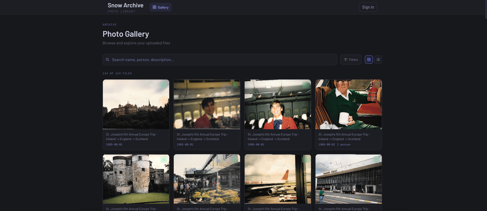

# Snow Family Archive



A private photo archive and media library built for the Snow family — and a portfolio project demonstrating full-stack cloud application development.

## About

This project was built to solve a real problem: a central, searchable place to store and share family photos across generations. It doubles as a showcase of my ability to design and ship production-grade web applications on Google Cloud.

## Tech Stack

| Layer | Technology |
|---|---|
| Frontend | React 19, Vite, React Router, React Query |
| Backend | Node.js, Express |
| Auth | Firebase Authentication |
| Database | Google Cloud Firestore |
| Storage | Google Cloud Storage |
| Hosting | Google Cloud Run (containerized) |
| CI/CD | Google Cloud Build |
| Secrets | Google Secret Manager |

## Features

- **Public gallery** — visitors can browse non-private photos without logging in
- **Authenticated upload** — single and bulk photo upload with metadata (date, people, description, privacy)
- **Search & filter** — search by description, filename, person, or date range
- **Inline editing** — edit photo metadata directly in the gallery
- **Audit log** — admin view of all upload, edit, delete, and view events
- **Geo-enriched visit logging** — server-side visitor tracking with IP geolocation
- **Responsive UI** — mobile-friendly with collapsible nav

## Architecture

```
Browser → Cloud Run (Express)
              ├── /api/public/files  → Firestore (public, no auth)
              ├── /api/*             → Firestore + GCS (Firebase Auth required)
              └── /proxy/:id         → GCS (image streaming)
```

The React app is built by Vite and served as static files by the same Express server. Firebase credentials are injected at build time via Secret Manager and Cloud Build.

## Local Development

```bash
# Install dependencies
npm install

# Run Express + Vite concurrently
npm run dev
```

Requires a `.env` file with Firebase and GCP credentials.

## Deployment

```bash
gcloud builds submit --config cloudbuild.yaml --project snowarchive-486816 --region us-central1
```

Cloud Build builds the Docker image (with Firebase config baked in), pushes to Artifact Registry, and deploys to Cloud Run.
